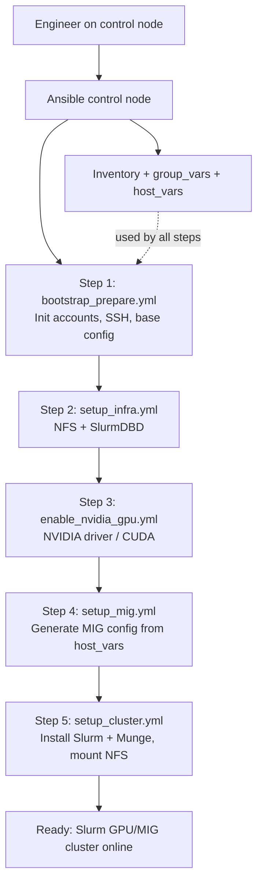

# Slurm HPC Cluster with NVIDIA MIG Support

This Ansible project automates the deployment of a Slurm HPC cluster, featuring advanced NVIDIA GPU configuration with MIG (Multi-Instance GPU) support and persistence.

## Project Structure

```
.
├── inventory/
│   ├── production.ini       # Main inventory file
│   ├── host_vars/           # Host-specific configurations (e.g., MIG profiles)
│   ├── group_vars/          # Group-level variables
│   └── vault/               # Encrypted secrets
├── playbooks/
│   ├── prepare/             # Bootstrap and preflight checks
│   ├── infra/               # Infrastructure (NFS, DB, MIG)
│   ├── cluster/             # Slurm cluster deployment
│   └── teardown/            # Cleanup scripts
└── roles/                   # Ansible roles
```

## Prerequisites

*   Ansible installed on the control node.
*   Target nodes accessible via SSH.
*   `inventory/vault/.ansible_vault_pass` file containing the vault password.

## Vault Setup

This project uses Ansible Vault to secure sensitive data (passwords).

1.  **Create the password file**:
    ```bash
    echo "your_secure_password" > inventory/vault/.ansible_vault_pass
    chmod 600 inventory/vault/.ansible_vault_pass
    ```

2.  **Edit encrypted variables**:
    ```bash
    ansible-vault edit inventory/group_vars/all/vault.yml --vault-password-file inventory/vault/.ansible_vault_pass
    ```
    Set the following variables:
    *   `vault_ansible_password`: Password for the `ansible` management user.
    *   `vault_ansible_become_password`: Sudo password for the `ansible` user.

## Configuration

### 1. Inventory
This project uses two inventory files:

*   **`inventory/prepare.ini`**: Used **ONLY** for the initial bootstrap (Step 1).
    *   Define the initial connection user (e.g., `ansible_user=ubuntu` or `root`) and password authentication method here.
    *   **Note**: This `ansible_user` must be an existing user on the target nodes with `sudo` privileges (root access) to allow Ansible to install packages and create the management user.
    *   This allows Ansible to connect to fresh nodes before SSH keys are set up.

Example `inventory/prepare.ini`:
```ini
[all:vars]
# Initial user (e.g., ubuntu, root)
ansible_user=ubuntu
# Force password auth and ignore host keys for fresh install
ansible_ssh_common_args='-o PreferredAuthentications=password -o PubkeyAuthentication=no -o StrictHostKeyChecking=no'
ansible_ssh_private_key_file=

[controller]
ctrl-node ansible_host=192.168.1.10

[compute]
gpu-node-01 ansible_host=192.168.1.20

[infra]
infra-node ansible_host=192.168.1.30
```

*   **`inventory/production.ini`**: Used for **ALL** subsequent steps (Step 2-5).
    *   Define your cluster topology here:
        *   `[controller]`: Slurm controller node.
        *   `[compute]`: Compute nodes with GPUs.
        *   `[infra]`: Infrastructure node (NFS, Database).
    *   Ensure hostnames match your DNS or `/etc/hosts`.
    *   **Note**: These steps use the `mgmt_user` (default: `ansible`) defined in `inventory/group_vars/all/main.yml`. This user is automatically created and configured with SSH keys during Step 1.

Example `inventory/production.ini`:
```ini
[controller]
ctrl-node ansible_host=192.168.1.10

[compute]
gpu-node-01 ansible_host=192.168.1.20
gpu-node-02 ansible_host=192.168.1.21

[infra]
infra-node ansible_host=192.168.1.30
```

### 2. MIG Configuration (Per-Host)
Configure MIG profiles in `inventory/host_vars/<hostname>.yml`. This configuration is used to generate a startup script (`/usr/local/sbin/configure-mig.sh`) that persists MIG settings across reboots.

Example (`inventory/host_vars/slurm.yml`):

```yaml
---
# slurm_gres_name is optional; Slurm role now auto-detects MIG profiles (e.g., gpu:2g.48gb)
# slurm_gres_name: "gpu" 

nvidia_mig_config:
  - gpu_index: 0
    enable_mig: true
    profiles:
      - "2g.48gb"
      - "2g.48gb"
  - gpu_index: 1
    enable_mig: true
    profiles:
      - "2g.48gb"
      - "2g.48gb"
```

## Deployment Flow



## Deployment Workflow

Run the playbooks in the following order:

### Step 1: Bootstrap Nodes
Initialize user accounts and SSH access.
```bash
ansible-playbook -i inventory/prepare.ini playbooks/prepare/bootstrap_prepare.yml --vault-password-file ./inventory/vault/.ansible_vault_pass
```

### Step 2: Setup Infrastructure
Deploy NFS Server and Slurm Database (SlurmDBD).
```bash
ansible-playbook -i inventory/production.ini playbooks/infra/setup_infra.yml --vault-password-file ./inventory/vault/.ansible_vault_pass
```

### Step 3: Enable NVIDIA GPUs
Install NVIDIA drivers, CUDA, and Fabric Manager on compute nodes.
```bash
ansible-playbook -i inventory/production.ini playbooks/cluster/enable_nvidia_gpu.yml --vault-password-file ./inventory/vault/.ansible_vault_pass
```

### Step 4: Configure MIG
Apply MIG partitioning and enable persistence mode via a systemd service (`mig-config.service`).
```bash
ansible-playbook -i inventory/production.ini playbooks/infra/setup_mig.yml --vault-password-file ./inventory/vault/.ansible_vault_pass
```

### Step 5: Deploy Slurm Cluster
Install Slurm Controller and Compute daemons, mount NFS, and configure Munge.
*Note: This playbook automatically detects GPU/MIG resources.*
```bash
ansible-playbook -i inventory/production.ini playbooks/cluster/setup_cluster.yml --vault-password-file ./inventory/vault/.ansible_vault_pass
```

## Verification

Log in to the controller node and check the cluster status. You should see the specific MIG profile in the GRES column:

```bash
sinfo -N -o "%N %G %t"
# Expected output example: slurm gpu:2g.48gb:4(S:0-1) idle
```

Submit a test job requesting a specific MIG slice:
```bash
srun --gres=gpu:2g.48gb:1 --pty /bin/bash
nvidia-smi -L
```

## Maintenance

*   **Teardown**: Use playbooks in `playbooks/teardown/` to remove components.
*   **Update MIG Profiles**:
    1.  Edit `inventory/host_vars/<hostname>.yml` with the new profiles.
    2.  Run the MIG setup playbook to update the persistence script and apply changes:
        ```bash
        ansible-playbook -i inventory/production.ini playbooks/infra/setup_mig.yml --vault-password-file ./inventory/vault/.ansible_vault_pass
        ```
    3.  (Optional) If the number of GPUs/MIGs changed, restart Slurm services to detect new resources:
        ```bash
        ansible-playbook -i inventory/production.ini playbooks/cluster/setup_cluster.yml --vault-password-file ./inventory/vault/.ansible_vault_pass
        ```
